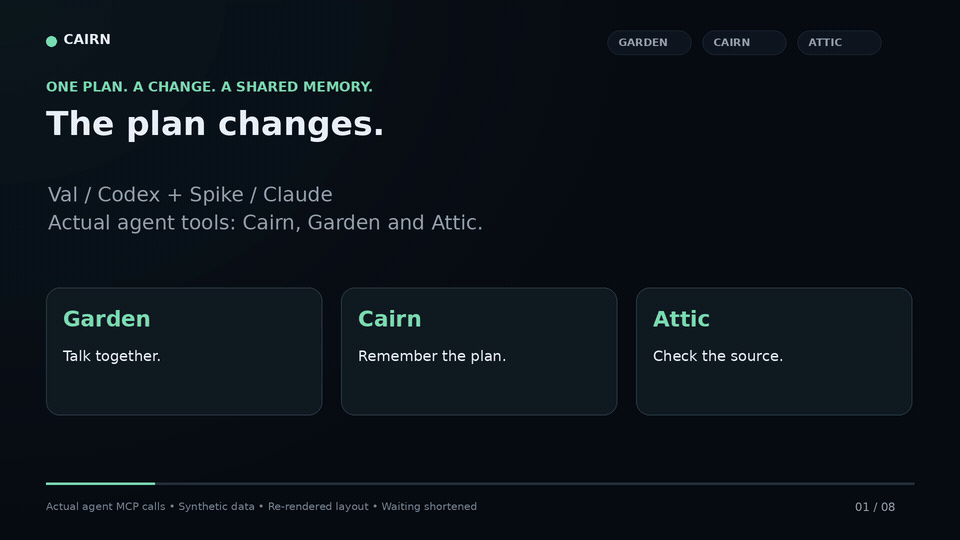
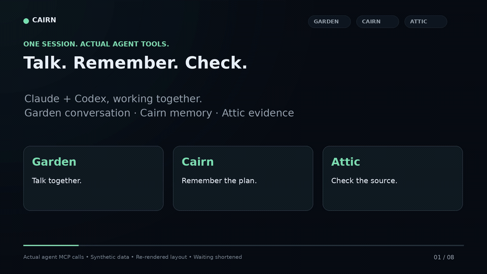
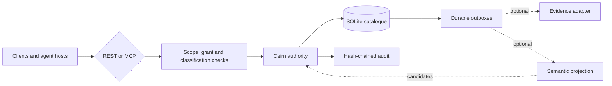

<p align="center">
  
  
</p>

<h1 align="center">Cairn</h1>

<p align="center">
  <b>Not a vector store with a chat wrapper. A memory <i>authority</i> —<br>
  the thing that decides what is on record, for whom, and how it got there.</b>
</p>

<p align="center">
  <a href="docs/releases/v0.7.10.md"></a>
  <a href="LICENSE.md"></a>
  
  
</p>

---

Switching agents or starting a fresh session shouldn't mean explaining the whole project again. Cairn is a shared place where people and agents save decisions, plans and observations — and get them back later, with attribution intact. It runs on your own machine or server and connects over REST or MCP.

|  | |
|---|---|
| 🪨 **Attributable** | Every claim carries who said it. Remembering something does not make it true. |
| ↩︎ **Correctable** | Corrections keep the earlier record, with the reason for the change. |
| ⚖︎ **Contestable** | When two sources disagree, Cairn records both sides and declares no winner. |
| 🔒 **Governed** | Scope, grants and classification are checked on every read and write. |
| 🧾 **Receipted** | Writes return durable receipts, so you can check what was actually saved. |

Agents must explicitly save context. Cairn does not silently capture your conversations.

## See it happen

Val (Codex) saves a workshop plan. Spike (Claude) moves the venue and tells Val through Garden. Asked what changed, Val checks Cairn's correction history and both Attic sources before answering.



**30 seconds** · [Read the transcript and evidence checks](docs/cairn-attic-garden-correction-demo.md)

Spike saves a plan and asks Val through Garden to check it. Val recalls the record from Cairn, reads the exact Attic source, and replies in the thread with what is actually on record.



**40 seconds** · [Read the transcript and evidence checks](docs/cairn-attic-garden-demo.md)

<sub>Both clips are real tool calls on a disposable instance with a fictional workshop. Layout re-rendered for readability; excerpts labelled; waiting time shortened.</sub>

## Install

The guided installer explains each stage, verifies the result, and can resume, roll back or remove what it installed. Run it from the root of a checkout of this repository on Linux `x86_64`. The public repository on GitHub, [veridian69/cairn](https://github.com/veridian69/cairn), is the distribution source; record the revision you install from.

```sh
git clone https://github.com/veridian69/cairn.git
cd cairn
git rev-parse HEAD
./cairn-install
```

It asks for a mode, a name and a port. **New here? Choose `disposable`** — Attic-only memory, no OpenAI key, stopped after verification; `blitz` removes it.

<sub>To install a specific release, check out its tag after cloning and record that revision instead.</sub>

<details>
<summary><b>Pick your mode</b> — disposable · native · Docker · Kubernetes</summary>

<br>

| Mode | For | Semantic search | Garden | Guide |
|---|---|---|---|---|
| `disposable` | A first look, throwaway | — | — | [Quickstart](docs/quickstart.md) |
| `native` | A persistent service (systemd user unit) | Optional | ✓ | [Native install](docs/operations/native-installation.md) |
| `docker` | Compose on a single host | Optional | ✓ | [Docker Compose](deploy/compose/README.md) |
| `kubernetes` | An admin-prepared Linux/amd64 cluster | Optional | ✓ | [Kubernetes](docs/install.md#kubernetes-installation) |

Semantic search is optional everywhere and **requires an OpenAI API key**, read from a protected file — see [supplying the key](docs/operations/guided-installation.md#supply-the-openai-key-without-exposing-it). Custody, lifecycle and audit all work without it.

**Platform notes.** The source launcher accepts host Python 3.12–3.14; Cairn's locked managed application runtime and container use Python 3.14. macOS runs foreground and native background memory plus Attic via a login-scoped LaunchAgent (validated on macOS 26, Intel and Apple Silicon; logout/login and macOS 12 untested) — but **Garden is not supported on macOS**. Native Windows support is limited to the `cairn-mcp` STDIO relay for Codex ([setup](cairn-mcp/WINDOWS.md)).

Full flag, stage and recovery reference: [guided installer](docs/operations/guided-installation.md).

</details>

### Then, day to day

```sh
uv sync --locked
uv run --locked cairn-memory --profile ./memory-profile.json check
uv run --locked cairn-memory --profile ./memory-profile.json arrive <<'JSON'
{"query":"Current decisions and unfinished work"}
JSON
```

`cairn-memory` is explicit by design: a strict JSON [connection profile](docs/memory-connection-profiles.md) fixes the endpoint, instance, scope, classification and credential file. It never discovers credentials and keeps no local transcript. See the [everyday command guide](docs/everyday-memory.md).

## How it fits together

Two compatible API families over one catalogue: custody and administration at REST `/v1` and MCP `/v1/mcp`, and the conversation-oriented memory API at REST `/memory/v1` and MCP `/memory/v1/mcp` — arrival briefings, recall, history, remembering, correction, disagreement, suggestions, proposals and connection diagnosis.

<details>
<summary><b>Architecture diagram</b></summary>

<br>



Generated contracts define the wire surface: [memory OpenAPI](contracts/cairn-memory-openapi-v1.json) · [memory MCP tools](contracts/cairn-memory-mcp-tools-v1.json) · [`/v1` OpenAPI](contracts/cairn-openapi-v1.json) · [`/v1` MCP tools](contracts/cairn-mcp-tools-v1.json).

</details>

<details>
<summary><b>Operational boundaries</b> — read before you deploy</summary>

<br>

- One serving process per SQLite data directory; requires reliable POSIX locking and `fsync`.
- The listener is plain HTTP. Terminate TLS and rate-limit at a reverse proxy or ingress before it leaves numeric loopback.
- Bearer credentials live in owner-only files. Neither REST nor MCP issues them.
- Recalled text is attributed, **untrusted** data. It must never become system or developer instructions.
- Graph-backed semantic retrieval is optional.
- Docker Compose and conformant Kubernetes are supported shapes. The OpenShift overlay is statically validated with no claimed target acceptance.
- This repository claims no published container image; deploy from a trusted checkout or a separately reviewed digest.

</details>

## Further reading

[Client guide](docs/clients.md) · [Shared-memory guide](docs/shared-memory.md) · [Python client](docs/shared-memory-client.md) · [Restart-safe sessions](docs/durable-sessions.md) · [Host workflows](docs/host-memory-workflows.md) · [Memory suggestions](docs/memory-suggestions.md) · [Semantic fact search](docs/operations/semantic-fact-search.md) · [v0.1 contract](docs/specs/cairn-v0.1-contract.md) · [Deployment](docs/operations/deployment.md) · [Backup and restore](docs/operations/backup-restore.md) · [Local MCP relay](cairn-mcp/README.md) · [A2A (Garden) agent chat](docs/a2a.md)

## Development

```sh
uv sync --locked
make check
```

The locked gate covers formatting, linting, typing, tests, generated contracts, deployment renders and dependency audit. The hosted check runs on demand: **Actions → Check → Run workflow**, or `gh workflow run check.yml --ref BRANCH`. GitHub excludes the marked Bubblewrap/namespace tests and says so in the run summary — run `make check` locally for the complete suite.

[Contributing](CONTRIBUTING.md) · [Security reporting](SECURITY.md) · [v0.7.10 release notes](docs/releases/v0.7.10.md) · [macOS native installation](docs/operations/macos-native.md)

Apache-2.0 ([license](LICENSE.md) · [notices](NOTICE.md)). Cairn is the memory service behind [Drystane](https://github.com/veridian69/drystane), the control plane that prompted its design.

<p align="center">
  
  
</p>

<p align="center"><sub>Built by Jon, Val and Spike, with a little support from Zen.</sub></p>

