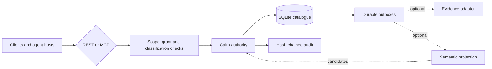

<p align="center">
  
  
</p>

## A perfect memory can still be wrong.

Cairn is a Linux-native shared memory service for humans, agents and
automation. It keeps attributed observations, preserves earlier beliefs when
they are corrected and lets different perspectives coexist. Scope,
classification and grants are enforced by the server; a stored claim does not
become established truth merely because it was remembered.

[Beginner installation requirements](docs/specs/beginner-installation-requirements.md) — planned native and Docker onboarding; implementation and acceptance are pending.

**Persistence is the starting point. Accountable memory is the point.**

## What memory has to answer

- **Who said this?** Facts retain provenance and a trust class.
- **Who may rely on it?** Realm and path scope, grants and classification govern every read and write.
- **What changed?** Correction and invalidation preserve history rather than silently replacing it.
- **What disagrees?** Disagreements retain both attributed endpoints; recording one does not decide who is right.
- **Was it saved?** Mutations return durable receipts. Replaying an identical operation with the same idempotency key does not create another write.
- **Can search cross those boundaries?** Retrieval candidates are reconciled against the authoritative catalogue before disclosure.

## Interfaces

Cairn exposes two compatible API families over one catalogue:

- the custody and administration API at REST `/v1` and MCP `/v1/mcp`;
- the conversation-oriented memory API at REST `/memory/v1` and MCP `/memory/v1/mcp`.

The memory API adds arrival briefings, recall, history, remembering,
correction, disagreement, suggestions, proposals and connection diagnosis.
Generated [OpenAPI](contracts/cairn-memory-openapi-v1.json) and
[MCP tool](contracts/cairn-memory-mcp-tools-v1.json) documents define its wire
surface. The original [OpenAPI](contracts/cairn-openapi-v1.json) and
[MCP tool](contracts/cairn-mcp-tools-v1.json) documents remain authoritative
for `/v1`.



## Use Cairn day to day

The `cairn-memory` command is an explicit Linux/WSL client. A strict JSON
[connection profile](docs/memory-connection-profiles.md) fixes the endpoint,
expected instance, exact scope, classification and credential file. It never
discovers credentials or records a local transcript.

```sh
uv sync --locked
uv run --locked cairn-memory --profile ./memory-profile.json check
uv run --locked cairn-memory --profile ./memory-profile.json arrive <<'JSON'
{"query":"Current decisions and unfinished work"}
JSON
```

See the [everyday command guide](docs/everyday-memory.md) for recall,
remembering, correction, disagreement, suggestions, proposals and exact retry.
The [shared-memory guide](docs/shared-memory.md) explains the trust model, while
the [Python client](docs/shared-memory-client.md) and
[restart-safe sessions](docs/durable-sessions.md) cover application integration.

Optional Codex and Claude skill packages use that same command on native Linux
or inside WSL, with all checkout and runtime files on the native Linux
filesystem. Installation is explicit and does not observe arbitrary desktop or
web conversations. The managed `cairn-chat` console starts fresh subscribed CLI
processes for submitted turns; only receipt-confirmed facts provide continuity.
See [host workflows](docs/host-memory-workflows.md) and the
[CLI adapter](docs/host-handover.md).

Native Windows support is limited to the `cairn-mcp` STDIO relay for Codex. It
does not install the Linux/WSL daily command or capture conversations. Follow
the [Windows relay setup](cairn-mcp/WINDOWS.md) and supply the exact trusted
upstream URL for your deployment.

## Start locally from source

The source quickstart needs Python 3.12, [uv 0.12.0](https://docs.astral.sh/uv/),
`curl` and `jq`. It creates an isolated instance under `/tmp`, keeps the
bootstrap credential outside the checkout and uses synthetic memory. Retrieval
stays disabled, so it makes no model-provider call.

```sh
uv sync --locked
```

Continue with the [source quickstart](docs/quickstart.md). This repository does
not claim a published container image; deployment instructions build from a
trusted checkout or use a separately reviewed digest.

## Operational boundaries

- Cairn runs one serving process per SQLite data directory and requires reliable POSIX locking and `fsync` semantics.
- Its listener is plain HTTP. Terminate TLS and apply rate limits at a reverse proxy or ingress whenever it leaves numeric loopback.
- Bearer credentials belong in owner-only files. Neither REST nor MCP issues them.
- Recalled text is attributed, untrusted data. It must not become system or developer instructions.
- Graph-backed semantic retrieval is optional. Catalogue custody, lifecycle and audit work without it.
- Docker Compose and conformant Kubernetes are supported deployment shapes. The OpenShift overlay is statically validated but has no claimed target acceptance.

Further reading:

- [Client guide](docs/clients.md) — authentication, scopes, calls and retry rules
- [Memory suggestions](docs/memory-suggestions.md) — read-only duplicate, correction and disagreement evidence
- [Semantic fact search](docs/operations/semantic-fact-search.md) — optional representation, degradation and rebuild
- [v0.1 contract](docs/specs/cairn-v0.1-contract.md) — normative behaviour
- [Deployment guide](docs/operations/deployment.md) — Compose and Kubernetes choices
- [Backup and restore](docs/operations/backup-restore.md) — recovery procedures
- [Local MCP relay](cairn-mcp/README.md) — Cloudflare Access bridge for Linux and Windows clients

## Development

The locked quality gate covers formatting, linting, typing, tests, generated
contracts, deployment renders and dependency audit:

```sh
uv sync --locked
make check
```

Cairn is licensed under the [Apache License 2.0](LICENSE.md). It is the memory
service used by [Drystane](https://github.com/veridian69/drystane), the control
plane that prompted its design.

<p align="center">
  
  
</p>

<p align="center"><sub>Built by Jon, Val and Spike, with a little support from Zen.</sub></p>
