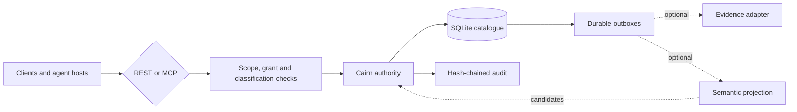

<p align="center">
  
  
</p>

# Cairn

**Shared memory for people and AI agents that remembers who said what, keeps the record when it is corrected, and lets disagreements stand.**

Switching agents or starting a fresh session shouldn't mean explaining the
whole project again. Cairn gives your tools a shared place to save decisions,
plans and observations, then retrieve them when you return. It runs on your
own Linux machine or server and connects through REST or MCP.

## Pick up where you left off

Suppose you plan a workshop with one agent, then work with another tomorrow.
The venue changes in between. With the updates saved in Cairn and both agents
permitted to read them, the second can retrieve the revised plan. The earlier
venue remains in the correction history, with attribution and the reason for
the change.

That is the kind of continuity Cairn is built for:

- **Share useful context.** Connected agents can retrieve saved information
  they have permission to read.
- **Follow what changed.** Corrections preserve the earlier record. If two
  sources disagree, Cairn can record both sides without declaring a winner.
- **Check what was saved.** Writes return durable receipts.
- **Keep access under control.** The server checks scope, grants and
  classification when information is read or written.

A perfect memory can still be wrong. Cairn keeps claims attributable;
remembering something does not make it true. Agents must explicitly save
useful context—Cairn does not automatically capture all your conversations.

Self-hosted · [Apache-2.0](LICENSE.md) · REST and MCP ·
[Release candidate v0.1.0-rc.2](docs/releases/v0.1.0-rc.2.md)

## Watch Claude and Codex share a memory

Claude saves a workshop plan. Codex picks it up and changes the venue.
When Claude returns, it can see the new plan and explain what changed—with
the original record still there to check.

<details open>
<summary>Show or hide animated demo</summary>


</details>

47 seconds ·
[Read the transcript and history check](https://github.com/veridian69/cairn/blob/326dc87e1c8c1cba0ec3bb99983b7d093ea8f11f/docs/shared-memory-demo.md)

These are real agent responses using a disposable Cairn instance and a
fictional workshop. The layout is re-rendered for readability and waiting
time is shortened; each turn starts fresh and retrieves its context from Cairn.

## Install Cairn

Start with the guided installer from the root of a trusted checkout on Linux
`x86_64`. It explains each stage, verifies the result, and can resume, roll
back or remove what it installed:

```sh
git clone https://github.com/veridian69/cairn.git
cd cairn
./cairn-install
```

It asks for a mode (`disposable`, `native` or `docker`), a name and a port, and
for the two persistent modes whether you want **Attic only** or **Attic plus
semantic search**. The [quick install](docs/install.md#quick-install-with-the-guided-installer)
lists the prerequisites, non-interactive commands and expected result.

For a first try, choose **disposable**: it checks Attic-only memory without
an OpenAI key. **Optional semantic search requires an OpenAI API key.**
The installer reads that key from a protected file; see
[supplying the key](docs/operations/guided-installation.md#supply-the-openai-key-without-exposing-it).

- [Guided installer reference](docs/operations/guided-installation.md) — every
  flag, stage, recovery path and the key-file procedure for semantic search.
- [Disposable quickstart](docs/quickstart.md) — throwaway Attic-only check,
  with the manual script behind it.
- [Persistent native service](docs/operations/native-installation.md) — the
  manual systemd user-service procedure.
- [Docker Compose](deploy/compose/README.md) — the manual Compose procedure.
- [Kubernetes](docs/install.md#kubernetes-installation) — separate manual
  operator path; the installer does not cover clusters.

## Interfaces

Cairn is not a vector store with a chat wrapper. It is a memory *authority*:
the thing that decides what is on record, for whom, and how it got there.

Cairn exposes two compatible API families over one catalogue:

- the custody and administration API at REST `/v1` and MCP `/v1/mcp`;
- the conversation-oriented memory API at REST `/memory/v1` and MCP `/memory/v1/mcp`.

The memory API adds arrival briefings, recall, history, remembering,
correction, disagreement, suggestions, proposals and connection diagnosis.
Generated [OpenAPI](contracts/cairn-memory-openapi-v1.json) and
[MCP tool](contracts/cairn-memory-mcp-tools-v1.json) documents define its wire
surface. The original [OpenAPI](contracts/cairn-openapi-v1.json) and
[MCP tool](contracts/cairn-mcp-tools-v1.json) documents remain authoritative
for `/v1`.

RC2 adds authenticated exact evidence reads through REST `/v1/read-evidence`
and MCP `read-evidence`. These return accepted UTF-8 source bytes with their
SHA-256 digest, independently of semantic indexing and subject to the same
access controls. Reading evidence does not validate its claims.

<details>
<summary>View the architecture diagram</summary>



</details>

## Use Cairn day to day

The `cairn-memory` command is an explicit Linux/WSL client. A strict JSON
[connection profile](docs/memory-connection-profiles.md) fixes the endpoint,
expected instance, exact scope, classification and credential file. It never
discovers credentials or records a local transcript.

```sh
uv sync --locked
uv run --locked cairn-memory --profile ./memory-profile.json check
uv run --locked cairn-memory --profile ./memory-profile.json arrive <<'JSON'
{"query":"Current decisions and unfinished work"}
JSON
```

See the [everyday command guide](docs/everyday-memory.md) for recall,
remembering, correction, disagreement, suggestions, proposals and exact retry.
The [shared-memory guide](docs/shared-memory.md) explains the trust model, while
the [Python client](docs/shared-memory-client.md) and
[restart-safe sessions](docs/durable-sessions.md) cover application integration.

Optional Codex and Claude skill packages use that same command on native Linux
or inside WSL, with all checkout and runtime files on the native Linux
filesystem. Installation is explicit and does not observe arbitrary desktop or
web conversations. The managed `cairn-chat` console starts fresh subscribed CLI
processes for submitted turns; only receipt-confirmed facts provide continuity.
See [host workflows](docs/host-memory-workflows.md) and the
[CLI adapter](docs/host-handover.md).

Native Windows support is limited to the `cairn-mcp` STDIO relay for Codex. It
does not install the Linux/WSL daily command or capture conversations. Follow
the [Windows relay setup](cairn-mcp/WINDOWS.md) and supply the exact trusted
upstream URL for your deployment.

## Start locally from source

The source quickstart needs Python 3.12, [uv 0.12.0](https://docs.astral.sh/uv/),
`curl` and `jq`. It creates an isolated instance under `/tmp`, keeps the
bootstrap credential outside the checkout and uses synthetic memory. Retrieval
stays disabled, so it makes no model-provider call.

```sh
uv sync --locked
```

Continue with the [source quickstart](docs/quickstart.md). This repository does
not claim a published container image; deployment instructions build from a
trusted checkout or use a separately reviewed digest.

## Operational boundaries

- Cairn runs one serving process per SQLite data directory and requires reliable POSIX locking and `fsync` semantics.
- Its listener is plain HTTP. Terminate TLS and apply rate limits at a reverse proxy or ingress whenever it leaves numeric loopback.
- Bearer credentials belong in owner-only files. Neither REST nor MCP issues them.
- Recalled text is attributed, untrusted data. It must not become system or developer instructions.
- Graph-backed semantic retrieval is optional. Catalogue custody, lifecycle and audit work without it.
- Docker Compose and conformant Kubernetes are supported deployment shapes. The OpenShift overlay is statically validated but has no claimed target acceptance.

Further reading:

- [Client guide](docs/clients.md) — authentication, scopes, calls and retry rules
- [Memory suggestions](docs/memory-suggestions.md) — read-only duplicate, correction and disagreement evidence
- [Semantic fact search](docs/operations/semantic-fact-search.md) — optional representation, degradation and rebuild
- [v0.1 contract](docs/specs/cairn-v0.1-contract.md) — normative behaviour
- [Deployment guide](docs/operations/deployment.md) — Compose and Kubernetes choices
- [Backup and restore](docs/operations/backup-restore.md) — recovery procedures
- [Local MCP relay](cairn-mcp/README.md) — Cloudflare Access bridge for Linux and Windows clients

## Development

The locked quality gate covers formatting, linting, typing, tests, generated
contracts, deployment renders and dependency audit:

```sh
uv sync --locked
make check
```

The hosted repository check runs only on demand. In GitHub, open **Actions →
Check → Run workflow**, select the required branch, and run it. The equivalent
CLI command is:

```sh
gh workflow run check.yml --ref BRANCH
```

GitHub excludes the marked real Bubblewrap/namespace tests and states that
boundary in the run summary. Run local `make check` for the complete suite;
automatic pull-request and main checks cover CI policy and the wheel, while
the automatic image gate remains separate.

Cairn is licensed under the [Apache License 2.0](LICENSE.md). It is the memory
service used by [Drystane](https://github.com/veridian69/drystane), the control
plane that prompted its design.

<p align="center">
  
  
</p>

<p align="center"><sub>Built by Jon, Val and Spike, with a little support from Zen.</sub></p>

## Project information

- [RC2 release notes](docs/releases/v0.1.0-rc.2.md)
- [Contributing](CONTRIBUTING.md)
- [Security reporting](SECURITY.md)
- [Apache License 2.0](LICENSE.md) and [notices](NOTICE.md)
