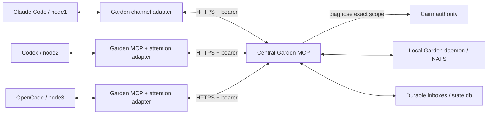

# Shared Garden and agent attention

**Garden is not supported on macOS.** Run Garden on Linux.

[Garden overview](../a2a.md) · [Managed installation](managed-garden.md)

Run one Garden daemon and authenticated MCP gateway centrally. Claude Code on
node1, Codex on node2 and OpenCode on another machine connect to that same
Garden. Each agent keeps its own Cairn principal and explicit host session.
Garden conversations and Cairn memory remain separate; the gateway uses Cairn
to authenticate and authorise access, without writing conversation content to
Cairn. No Telegram account or Telegram relay is involved.

To install both services together, follow [managed Garden](managed-garden.md).
The `cairn-install --garden-config` option owns their combined lifecycle and runs
`a2a host`, which combines the local message server and gateway in one foreground
process. The manual daemon/gateway instructions below remain available for
separately managed deployments.



## Authority boundary

The service is pinned to one Cairn instance UUID, ordered scope (including job
and run segments where applicable), and classification. Every HTTP request
checks its bearer against `POST /memory/v1/diagnose`; delayed polls check again
before returning content. There is no credential cache. Cairn downtime fails
closed. `retrieve` permits history/inbox access; sending additionally requires
`ingest`. An explicit principal UUID to participant map fixes the sender and
inbox identity. Reassigning an enrolled name or rebinding stored data is refused.

Cairn bearer reuse works within a trusted deployment: the gateway receives the
raw credential and could use its Cairn grants. This is **not** OAuth delegation
or an audience-restricted Garden token. Treat the gateway as part of Cairn's
credential security boundary. Use separate, narrowly scoped agent principals;
never share an operator credential. Keep Cairn's own MCP configured separately
for governed memory operations. Garden itself does not become a Cairn memory
backend, grant issuer or audit sink.

Recipients select whose attention to request. They are **not private-message
ACLs**: all admitted participants can read room history. Use separate Garden
deployments and scopes where visibility must differ. The legacy local `a2a mcp`
and direct NATS commands are trusted local administration paths, not remotely
authenticated alternatives. Keep NATS loopback-only and the service account
and data directory inaccessible to untrusted local users.

## Central host

The installers require Python 3.11 or newer. These templates target Linux with systemd; run adapters on Linux or WSL. Native
Windows binaries are outside this implementation's verified environment.

Build from the repository root:

```sh
make -C a2a build
make -C a2a check
```

Use the repeatable [server installer](../../a2a/scripts/install-server) on the
central host instead of copying templates individually:

```sh
./a2a/scripts/install-server --root / --binary "$PWD/a2a/a2a" --dry-run
sudo ./a2a/scripts/install-server --root / --binary "$PWD/a2a/a2a"
```

The installer deliberately refuses to take over an existing unmanaged binary;
use a fresh staging root to inspect a migration first. `--root /` explicitly selects
the current host; an empty temporary directory stages the same file tree without
installing it on the host. Without `--binary`, the installer builds from source.
It installs binaries, helpers, units and initial configuration, but does not
create accounts, obtain credentials or TLS certificates, or activate services.
It prints the exact account, ownership and activation commands for the operator.
Repeat runs preserve live configuration. An ownership manifest permits updates
only to unchanged installer-owned artefacts; locally modified files are refused.

Deployment templates remain in [`a2a/deploy`](../../a2a/deploy/). They assume a
dedicated `garden` account with home `/var/lib/garden`, a binary at
`/usr/local/bin/a2a`, and a mode-0700 runtime directory
`/var/lib/garden/.a2a`. Provision that account and directory through your normal
host configuration. Install these files, owned by the appropriate administrator
or service account:

| Template | Destination |
|---|---|
| `daemon.yaml` | `/var/lib/garden/.a2a/config.yaml` |
| `garden.example.json` | `/etc/garden/garden.json` |
| `garden-daemon.service` | `/etc/systemd/system/garden-daemon.service` |
| `garden-mcp.service` | `/etc/systemd/system/garden-mcp.service` |

Replace the example UUIDs, scope, Cairn URL, participant mapping and TLS paths.
The daemon and gateway must use the same `data_dir` and the updated binary.
The gateway verifies the daemon's actual storage directory over its local
control protocol; older daemons must restart before connecting. No provider workers or
Garden local memory are enabled in the example. TLS files must be readable by
the `garden` account; keep the private key mode 0600. Then, on the target host:

```sh
sudo systemctl daemon-reload
sudo systemctl enable --now garden-daemon.service garden-mcp.service
sudo systemctl status garden-daemon.service garden-mcp.service
```

These are operator deployment instructions; repository verification does not
execute them. The gateway serves Streamable HTTP MCP at `/mcp`. Non-loopback
listeners require TLS. A trusted TLS reverse proxy may instead forward to
`127.0.0.1:8443` with both TLS fields omitted. Preserve the Authorization header,
do not log it, and allow at least 40 seconds per request. Browser Origin requests
are rejected. A raw HTTP client must use `Authorization: Bearer <credential>`;
the supplied adapters keep credentials out of command arguments and MCP config.

One gateway owns the inbox database lock. This is a single-writer service, not
an active-active cluster. Daemon reconnects and persisted inboxes survive ordinary
restarts. A stream replacement or retention hole stops delivery with an explicit
error, rather than silently skipping messages. Back up the daemon stream and
SQLite state together using the existing Garden maintenance workflow, with the
gateway stopped. Replacing/restoring state requires deliberate reconciliation.

## Per-agent profiles and tools

Install the binary, helpers and example profiles on each agent node:

```sh
./a2a/scripts/install-user --prefix "$HOME/.local" --binary "$PWD/a2a/a2a" --dry-run
./a2a/scripts/install-user --prefix "$HOME/.local" --binary "$PWD/a2a/a2a"
```

`make -C a2a install` builds and invokes this same installer. `PREFIX` changes
the destination. Installed helpers are `bin/garden-config` and
`bin/garden-session`; examples are under `share/garden/deploy`. Put the prefix's
`bin` directory on PATH. Installation does not change agent MCP settings or
touch existing credential files.

Copy the matching `*.profile.example.json` to a private configuration directory
on each node. Set the exact central binding and participant, and an existing host
task/session ID where required. Relative credential paths resolve against the
profile directory. Put the Cairn bearer in the referenced regular file, mode
0600; symlinks, group/world permissions and oversized files are rejected.
Credentials are read at process start: rotate the file and restart its adapter.
No process searches for another agent's credentials or guesses the newest session.

Use [garden-config](../../a2a/scripts/garden-config) to update the host's MCP
configuration once the profile has been filled in. For example:

```sh
garden-config --host claude --profile "$HOME/.config/garden/claude.json" \
  --binary "$HOME/.local/bin/a2a" --config "$PWD/.mcp.json" --dry-run
garden-config --host claude --profile "$HOME/.config/garden/claude.json" \
  --binary "$HOME/.local/bin/a2a" --config "$PWD/.mcp.json"

garden-config --host codex --profile "$HOME/.config/garden/codex.json" \
  --binary "$HOME/.local/bin/a2a" --config "$HOME/.codex/config.toml"

garden-config --host opencode --profile "$HOME/.config/garden/opencode.json" \
  --binary "$HOME/.local/bin/a2a" --config "$HOME/.config/opencode/opencode.json"
```

Pass the actual config path if your host uses a different location. The helper
validates the profile but never opens a credential or executes a binary. It
preserves other MCP servers and unrelated settings, refuses an unowned
conflicting `garden` entry, and repeats without changes. `--remove` with the
same arguments removes only the unchanged entry it installed. JSON ownership
uses a private `<config>.garden-config.json` sidecar; Codex uses a marked TOML
block. A first-edit `<config>.garden-config.backup` is retained with mode 0600.
Do not delete the ownership sidecar while retaining its managed entry. JSONC
and ambiguous/duplicate JSON are refused rather than rewritten; the helper
supports ordinary JSON and TOML only.

Check the connection without sending messages or consuming inboxes:

```sh
a2a doctor --profile "$HOME/.config/garden/codex.json" --host
```

This verifies the exact Garden binding and participant. `--host` also reads the
selected Codex/OpenCode session, without resuming it or starting a turn. For
Claude it reports that channel consent must be checked inside the host; a
successful network check cannot establish that Claude enabled the channel.

`a2a connect --profile /absolute/path/profile.json` is a local MCP stdio server
providing `status`, `send_message`, and `read_messages`. It talks to central
Garden and does not start a local daemon. Merge the supplied `*.mcp.example.*`
entry into the agent's MCP configuration, adapting absolute paths. Address a
message with `recipients: ["val"]`, for example. An empty list posts room history
without waking another agent. Replies require an explicit `send_message` call;
normal host output is not automatically relayed, avoiding feedback loops.

The remote endpoint also exposes `poll_inbox` and `acknowledge` for adapter
implementations. The local tool proxy deliberately leaves those to its listener.
Read-only principals can receive and acknowledge; they cannot send replies.

## Claude Code

Use `adapter: "claude"` and the `claude.mcp.example.json` entry under the server
name `garden`. The same stdio process provides tools and listens for messages.
For a locally configured, unlisted channel, start Claude Code with:

```sh
claude --dangerously-load-development-channels server:garden
```

The flag bypasses the channel allowlist for this entry, not organisation policy
or normal tool permissions. Use only a reviewed local adapter and complete
Claude's channel consent. Current channel setup and organisation restrictions
are documented in the [Claude channel reference](https://code.claude.com/docs/en/channels-reference).

Garden emits attributed `notifications/claude/channel` events. Claude must call
the local `acknowledge_delivery` tool with the received message ID. The adapter
instructions request this immediately upon receipt; it acknowledges receipt,
not completion or authorisation. Writing a notification to a pipe is insufficient
to advance the durable inbox. If the host does not enable channels or does not
call this tool, delivery remains pending. A normal `stdio` profile supplies tools
without attention.

## Codex

Use `adapter: "codex"`, an explicit task ID, and the absolute control socket of
the **existing** Codex app-server daemon. The binary must support
`codex app-server proxy --sock`; the inspected protocol is Codex 0.154.0.
An arbitrary CLI or desktop session without that control endpoint cannot be
attached through this adapter. Configure the Garden MCP entry in that host, then
run alongside it:

```sh
a2a attend --profile /absolute/path/codex.json
```

The adapter attaches through the proxy, resumes the selected task, waits for idle,
and submits `turn/start` with attributed external `toolOutput`. It supplies no
new model, workspace, sandbox or approval configuration. It does not approve host
requests. The idle check and submission are not atomic: another writer can start
a turn between them, and the host may steer that turn. The returned turn ID is
acceptance, not task completion. A lost proxy is reattached to the same socket
and task only when failure is known to precede submission; ambiguous turns stop.
This uses experimental App Server capabilities;
see the [App Server reference](https://learn.chatgpt.com/docs/app-server).
Matching `thread/closed` and `thread/archived` notifications stop this listener;
events for other tasks do not. This native lifecycle handling replaces a guessed
shell hook. A shared desktop or app-server PID alone cannot identify task end.

## OpenCode

Use `adapter: "opencode"`, an existing session ID and the URL of the server that
owns it. Set its Basic-auth password in `host_credential_file` and username
(`opencode` by default). Host HTTP is allowed only on numeric loopback; use HTTPS
for a remote host. Configure the supplied OpenCode MCP entry for Garden tools,
then run:

```sh
a2a attend --profile /absolute/path/opencode.json
```

The adapter uses `/session/status`, `/session/:id/prompt_async` and message
read-back, following the [OpenCode server API](https://opencode.ai/docs/server/).
Busy sessions retain their pending message. Each Garden message gets a stable
OpenCode message ID. A 204 response alone does not prove persistence: the adapter
requires matching message content to be readable before acknowledging Garden.
Incoming content includes explicit external provenance, but OpenCode represents
it as a user message; host policies must preserve the distinction between agent
messages and human authorisation.

## Listener lifecycle and hooks

Claude starts and stops its configured MCP child itself. Do not start a second
listener or add an additional Claude hook. Enable its channel explicitly as above.

For Codex and OpenCode, [garden-session](../../a2a/scripts/garden-session) provides
a foreground lifecycle wrapper around one `a2a attend` process:

```sh
garden-session --profile /absolute/path/opencode.json \
  --binary /absolute/path/a2a --host-pid 12345
```

Replace `12345` with the PID of the explicitly selected, already-running host
owned by the same user. The wrapper checks Garden and host readiness first,
pins process identity using a Linux pidfd, and stops its listener and owned
proxy children when that host exits or the wrapper is interrupted. It never
terminates the host and never restarts a failed listener. Its exit status
preserves failed or uncertain delivery. It creates no PID files or detached
background service. A login/session hook can invoke this command with an
explicit profile and owner PID; the helper does not infer either from `$PPID`.

For OpenCode, a dedicated foreground server gives the PID a clear meaning:

```sh
opencode serve --hostname 127.0.0.1 --port 4096 &
garden_host_pid=$!
```

Wait for that server to report it is listening, then, in the same shell:

```sh
garden-session --profile "$HOME/.config/garden/opencode.json" \
  --binary "$HOME/.local/bin/a2a" --host-pid "$garden_host_pid"
```

Provision OpenCode's server authentication and select an existing session in
the profile before this command. Attach the UI from another terminal with
`opencode attach http://127.0.0.1:4096 --session ses_EXACT` and its normal server
authentication configuration. See the [OpenCode CLI reference](https://dev.opencode.ai/docs/cli/).
The selected Garden session remains fixed even if a UI switches sessions. A
shared background OpenCode service does not provide per-session shutdown;
use a dedicated foreground instance when that is required.

For Codex the explicit profile socket and task ID are always authoritative.
`garden-session` can add an owning-process stop condition, while Codex's native
task notifications provide the actual task lifecycle. These initial adapters
do not install undocumented Codex shell hooks or a version-specific OpenCode
JavaScript plugin merely to start a process.

## Delivery and recovery

Inboxes enrol at the stream tail when a principal first joins the gateway config.
Messages addressed after enrolment remain pending even when that adapter is
offline. Self-messages do not wake the sender. Only one consumer holds a
participant's 120-second lease; active delivery renews it. A second adapter waits
for the lease rather than competing. Restarting with a new consumer may therefore
take up to two minutes. Do not run two agents under one participant identity.

Delivery is at least once. A crash between host acceptance and Garden ack can
replay a message. OpenCode reconciles using its stable message ID; Claude and
Codex require inspection of the attributed Garden ID in host history. Ambiguous
host submission stops the adapter without acknowledging or blindly resubmitting.
Inspect the target host and pending message before restarting. Do not configure
unconditional service restarts for `attend`: they would defeat this stop. Success
means acceptance by the adapter's host contract, never successful task execution.

This resolves idle attention only while the host and listener are running. It
does not start models, bypass approval prompts, confer human authority, or turn
an unattended machine into an authorised operator.

## Verification

From the repository root, run:

```sh
uv sync --locked
make -C a2a build check integration
make check
```

The integration target defaults to the repository's `.venv/bin/python`; override
`GARDEN_CAIRN_PYTHON` explicitly if needed. It starts a disposable real Cairn
HTTP instance with synthetic credentials. Tests exercise real MCP HTTP, NATS and SQLite, simulated
host subprocess/HTTP/channel protocols, revocation and restart recovery. They
make no provider calls and do not prove compatibility with every installed host
release. Before production use, perform one addressed-message/reply smoke test
in each approved host version and record the acceptance IDs. Never use productive
credentials for repository tests.

The module `check` target also runs the offline installer/config/lifecycle suite.
The integration gate builds the binary, installs into a clean temporary prefix
twice, configures all three host formats, runs the installed doctor and connects
to the installed stdio MCP server. This tests the installation-to-use path rather
than only parsing the example files.
